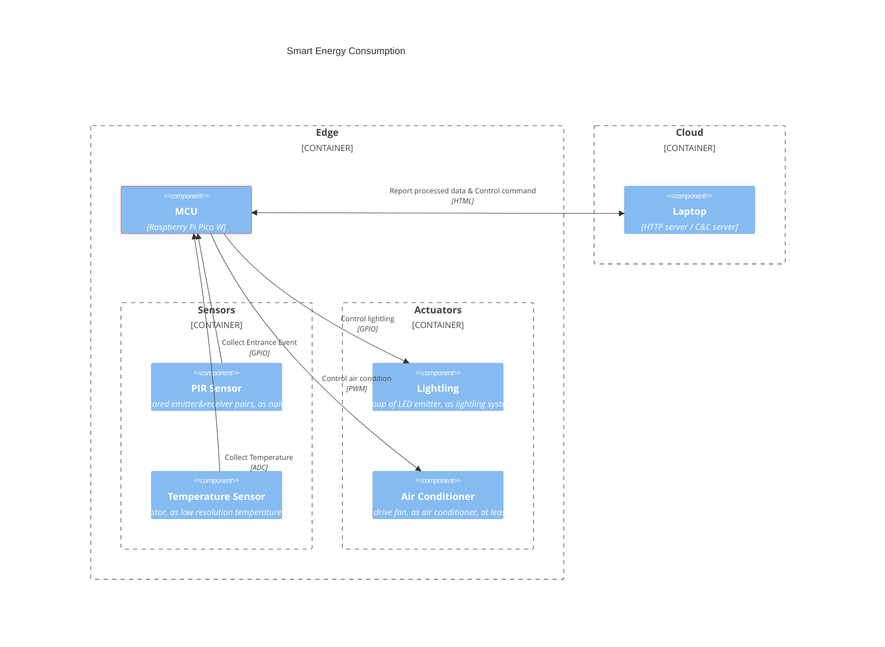
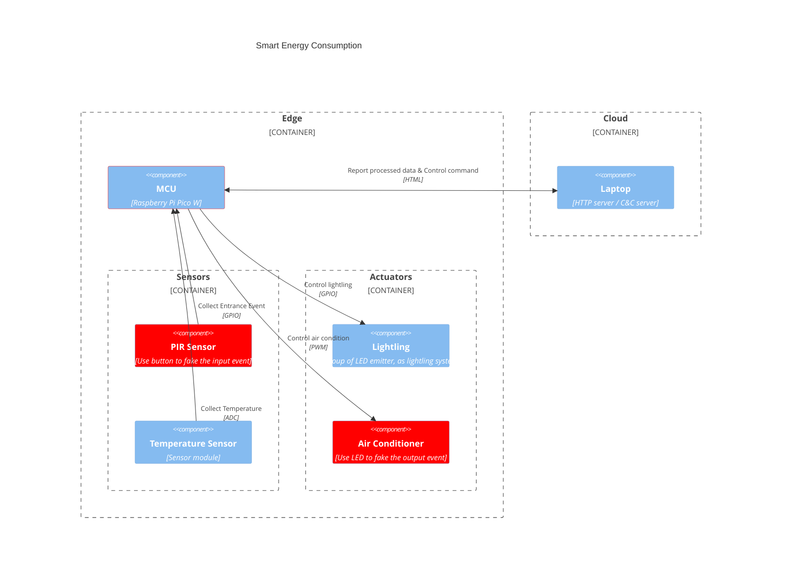

[TOC]

# Team Project: Smart Energy Consumption

## Members

* Shammy
* Kanij
* Sobia
* Lu

## Goal

Implement an IoT system described as below:

## Functionality

### Smart Lightling

* Use PIR sensor to detect which area has human activity, turn on lights where there has activity
* Use PIR sensor to detect entrance&exit of the door, turn off lights when the room is empty

### Smart Air Conditioning

* Use temperature sensor to collect data inside the room, report to cloud server
* Cloud server calculate a target temperature, command edge device to achieve that
* note: use a DC motor to drive fan, pretending it's an air conditioner

## BOM

| Material          | Mounting     | Quantity | Refrence                                                     |
| ----------------- | ------------ | -------- | ------------------------------------------------------------ |
| LED Emitter       | Through Hole | 5 pcs    | https://www.mouser.fi/ProductDetail/Vishay-Siliconix/TLHG5420-KSZ?qs=sGAEpiMZZMusoohG2hS%252B1%2F8Ds1DTNiHJSLSyZrPjIqf1ycZScCrJtg%3D%3D |
| Infrared Emitter  | Through Hole | 5 pcs    | https://www.mouser.fi/ProductDetail/Vishay-Semiconductors/TSAL6102UL?qs=sGAEpiMZZMsn8wIhgY8aVaM3i806UG0nG%252BhpehqmLc2LpLsgeDf94g%3D%3D |
| Infrared Receiver | Trough Hole  | 5 pcs    | https://www.mouser.fi/ProductDetail/Vishay-Semiconductors/TSOP38233?qs=Fg5d7evCualClrZuTI5HvQ%3D%3D |
| DC Motor          | N/A          | 1 pcs    | https://www.adafruit.com/product/711                         |
| NTC Thermistors   | Through Hole | 2 pcs    | https://www.mouser.fi/ProductDetail/Vishay-BC-Components/NTCLE100E3102HB0A?qs=sGAEpiMZZMt1hubY80%2Fs8C829rhMk7h96E%2FTXv1UmcqPmZt0vDMoVQ%3D%3D |
| Miscs             |              |          | PN2222 Transistor 1N4001 diode Resistor            |

# Implementation

## Hardware Connections

### LED Through-hole

LED component has polarity

Alert: Do not connect without resistor protection to limit the current

### PIR HC-SR501

We planed to connect the Vcc to power supply, GND to share common ground with Pico, and OUT to Pico.

But we failed to find the materials to create a 5V power supply, such as cascaded battery.

### Motor and Driver board

The driver board TB6612FNG to control the brush-less DC step motor also need a 5V power supply. We planned to connect AIN1/AIN2 to control the direction, PWMA to control the speed, and A01/A02 to drive the motor.

We failed due to the same reason, lacking of materials to create a 5V power supply.

### Miniature Cooling Fan

The cooling fan also need 5V power supply, we did the experiment to use 3.3V and failed.

### Changes

Compared to our original [design](#GOAL) , we did some changes to overcome the 5V power supply shortage without losing the essence of the project, changes marked as red in below chart.

